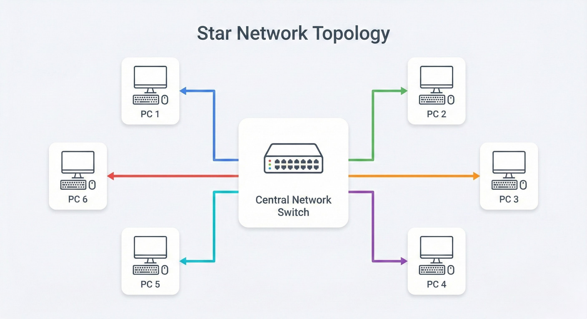
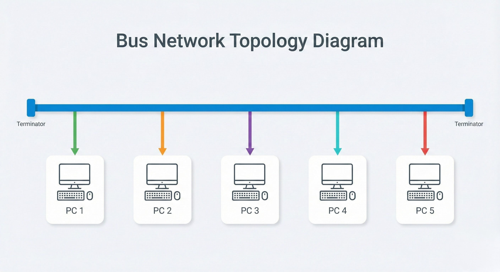
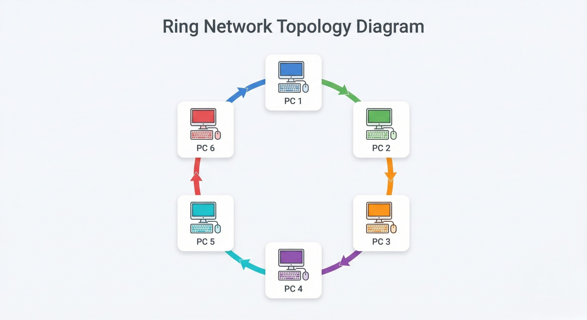
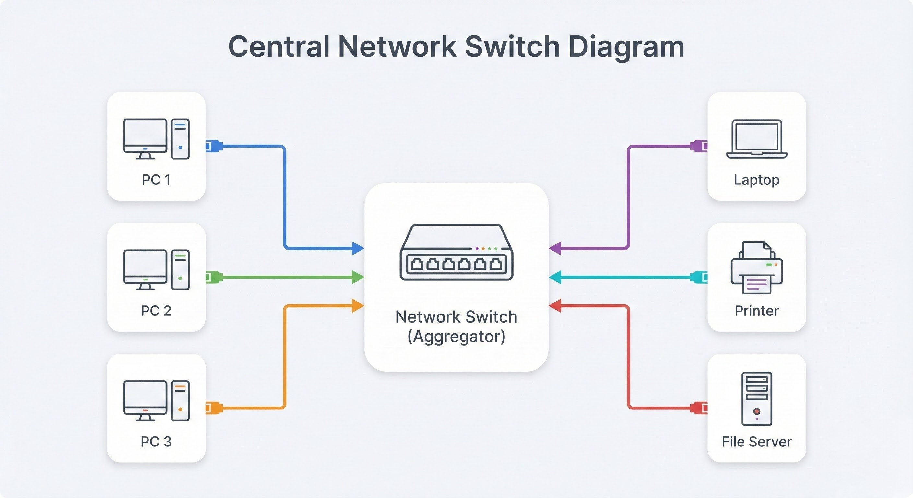
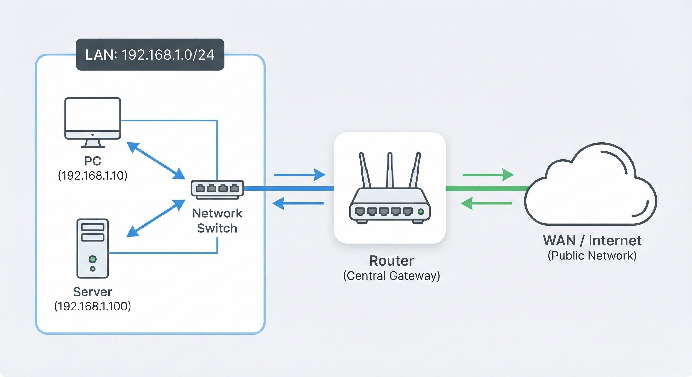
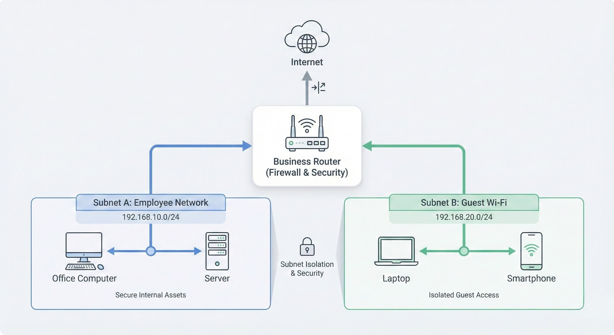
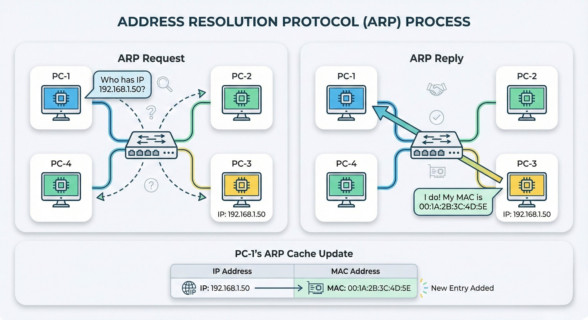
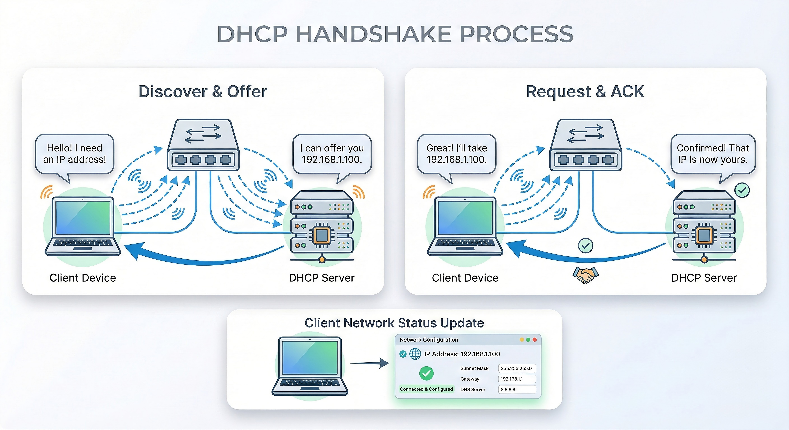

# LAN Concepts

> This section will explore the key ideas behind Local Area Networks (LANs), including the different ways to lay them out, known as topologies.

---

## 1. LAN Topologies

When we talk about a LAN, the word "topology" might sound complicated, but it really just means the design or layout of the network. Think of it as the blueprint for how all the devices are connected to each other.

We'll cover three main topologies here.

### 1.1. Star Topology

The main idea of a star topology is that every devicewhether it's a PC, a printer, or anything elseis individually connected to a central network device, like a switch or a hub. This is the most common topology found today because it's so reliable and easy to expand.

  
   
  <em>Figure 1: A diagram of a Star Topology network.</em>

*   **Advantages:**
    *   **Reliable:** If one cable fails, only one device loses its connection. The rest of the network keeps working just fine.
    *   **Scalable:** Want to add a new computer? Just run a new cable to the central hub. It's that simple!

*   **Disadvantages:**
    *   **Expensive:** Because every device needs its own cable and you have to buy a dedicated central device (like a switch), the cost is higher than other topologies.
    *   **Single Point of Failure:** Although it's rare because central devices are often built to be robust, if that central hub failsthe entire network goes down.
    *   **Maintenance & Troubleshooting:** The bigger the network gets, the more complex it is to maintain. Finding faults can also become much harder.

---

### 1.2. Bus Topology

A bus topology relies on a single main cable known as a "backbone." You can picture it like the main branch of a tree, where all the network devices are like leaves stemming from it.

  
   
  <em>Figure 2: A diagram of a Bus Topology network.</em>

*   **Advantages:**
    *   **Cheap & Easy to Set Up:** This is one of the cheapest and easiest topologies to install because you just need one main cable and don't need a lot of expensive networking gear.

*   **Disadvantages:**
    *   **Easily Bottlenecked:** All data travels on the same cable. If many devices try to send data at once, the network gets slow and congestedlike a traffic jam.
    *   **Hard to Troubleshoot:** With all the data running along the same path, it's very difficult to pinpoint which device is causing problems when an issue occurs.
    *   **No Redundancy:** If that main "backbone" cable breaks anywhere, the entire network fails.

---

### 1.3. Ring Topology

In a ring topology, devices are connected directly to each other in a closed loop. This setup requires less cabling and doesn't depend on an expensive central device like a star topology does.

  
   
  <em>Figure 3: A diagram of a Ring Topology network.</em>

*   **How it Works:** Data is sent around the ring, passing from one device to the next until it reaches its destination. An interesting rule here is that a device will only forward data from another device if it doesn't have any of its own data to send. If it does, it will send its own data first.

*   **Advantages:**
    *   **Fewer Bottlenecks:** It's less prone to bottlenecks than a bus topology because large amounts of traffic aren't all competing on the same line at the same time.
    *   **Easy to Troubleshoot:** It's fairly straightforward to find faults on the network.

*   **Disadvantages:**
    *   **Inefficient Data Travel:** Data might have to hop through many other devices before it gets where it needs to go, which isn't very efficient.
    *   **Entire Network Can Fail:** This is a double-edged sword. A single faultlike a cut cable or a broken devicebreaks the loop and brings the entire network down.

---

## 2. Switches

Switches are like the traffic cops of a network. They are special devices designed to connect many other devices, such as computers, using Ethernet cables. You'll usually find switches in bigger networks because they're great at connecting a lot of different devices. They come with many "ports" where devices can plug inyou might see switches with 4, 8, 16, 24, 32, or even 64 ports!

Switches are much smarter and more efficient than older network devices like hubs or repeaters. A switch keeps a record of exactly which device is connected to which port. So, when a switch gets a piece of data (called a "packet"), instead of sending it to **every single** port like a hub would, it sends that packet directly and only to the device it's meant for. This drastically cuts down on unnecessary network traffic and makes the network run much smoother and faster!

You can also connect switches and routers together. This is a clever way to make your network more reliable (we call this "redundancy"). By adding multiple paths for data to travel, if one path ever goes down, the data can simply take another route. This means your network won't have any downtime, even if it might take a tiny bit longer for packets to reach their destination sometimes.

  
   
  <em>Figure 4: A diagram illustrating a network switch connecting multiple devices.</em>

---

## 3. Routers

Routers are the devices that connect different networks together and help data travel between them. Think of a router as a traffic controller for data, directing information to its correct destination across various networks. Its main job is called "routing"which is where the name "router" comes from!

Routing is the process where data finds its way from one network to another. It's like a GPS for your network traffic, figuring out the best path for your data to take so it can be delivered successfully. This is super useful when there are many possible paths or connections between different networks.

  
   
  <em>Figure 5: A diagram illustrating a router connecting two different networks.</em>

---

## 4. Subnetting

Imagine you have a huge box of mixed LEGO bricks. Subnetting is like sorting those bricks into smaller, organized bins based on their color or size. In networking, we do the same thing. Network administrators use subnetting to split a large network into smaller, more manageable sections, or "sub-networks."

This is done using a **subnet mask**, which is just a set of numbers that tells the network which part of an IP address is the "network" part and which part is the "device" part. An IP address is made of four numbers (called octets), and a subnet mask looks very similar.

In any subnet, IP addresses are used in three key ways:

*   **Network Address:** This is like the "street name" for your sub-network. It identifies the network itself but isn't assigned to any single device. For example, a device with the IP address `192.168.1.10` is on the network `192.168.1.0`.
*   **Host Address:** This is the "house number" for a specific device on that street. Each device (like your laptop or phone) gets a unique host address so data can find it. For example, `192.168.1.10` could be your laptop.
*   **Default Gateway:** This is the "exit" off your street. Its a special address given to a device (usually a router) that knows how to send information to *other* networks. If your laptop wants to talk to a website on the internet, it sends the data to the default gateway first.

Subnetting is great for efficiency and security. It lets you create separate zones within your network while still allowing them to connect to the wider internet.

#### **Example: A Small Business Network**

Consider a small business office. You'd want to keep the company's internal network separate from any public Wi-Fi you offer to guests.

*   **Subnet 1 (Employee Network):** This network is for company computers, servers, and sensitive internal devices. Only employees have access.
*   **Subnet 2 (Guest Wi-Fi):** This network is for visitors and customers. It provides internet access but is isolated from the main employee network for security.

By creating these separate subnets, the business ensures its critical data and systems are protected, even if the guest Wi-Fi gets compromised.

  
   
  <em>Figure 6: A diagram showing a router creating two separate subnets for different types of networks in a small business.</em>

---

## 5. ARP (Address Resolution Protocol)

Think of the ARP protocol as the network's phonebook. Its main job is to match a logical IP address (like a person's name) to a physical MAC address (like a fingerprint). Because devices on a local network need the physical MAC address to deliver data directly, ARP is the technology that bridges this gap.

Every device keeps a small log, called an **ARP cache**, to remember which IP address belongs to which MAC address. This saves it from having to ask the same question over and over.

The process works using two simple message types:

*   **ARP Request:** When your computer needs to find the MAC address for a known IP address, it shouts a message to every device on the network, asking, "Who has this IP address?"
*   **ARP Reply:** All devices hear the request, but only the one with that specific IP address sends a message back, saying, "I have that IP! Here is my MAC address."

Once your computer receives the ARP reply, it stores the IP and MAC address pair in its ARP cache. Now it can send data directly to the other device without having to ask againat least until the entry in its cache expires.

  
   
  <em>Figure 7: A diagram illustrating the ARP Request and ARP Reply process.</em>

---

## 6. DHCP (Dynamic Host Configuration Protocol)

Imagine you're checking into a hotel. You don't pick your room number yourself; the front desk assigns one to you. DHCP works similarly for devices on a network. Its job is to automatically hand out IP addresses to devices as they connect, so you don't have to manually type in an IP address for every phone, laptop, or tablet.

When a new device joins a network, it goes through a four-step process with a **DHCP server** to get its IP address:

1.  **DHCP Discover:** The new device shouts a message to everyone on the network saying, "Hello! I need an IP address. Is there a DHCP server out there?"
2.  **DHCP Offer:** A DHCP server (if one is available) hears this and replies directly to the device, saying, "Hey, I have an IP address you can use: [suggested IP address]."
3.  **DHCP Request:** The device then replies back to the server, confirming, "Yes, please! I'd like to use that IP address you offered."
4.  **DHCP ACK (Acknowledgement):** Finally, the DHCP server sends a last message to the device, saying, "Okay, that IP address is all yours. You're good to go!"

After this handshake, the device has its own unique IP address and can start communicating on the network. This automatic assignment makes managing large networks much easier.

  
   
  <em>Figure 8: A diagram illustrating the DHCP Discover, Offer, Request, and ACK process.</em>

---

##  Test Your Knowledge

Ready to check your understanding? Try this short quiz.

 **[Start the LAN concepts Quiz](https://tnsqkyy.github.io/hackbook/foundations/preSEC/net-basics/lan-concepts/quiz/index.html)**
