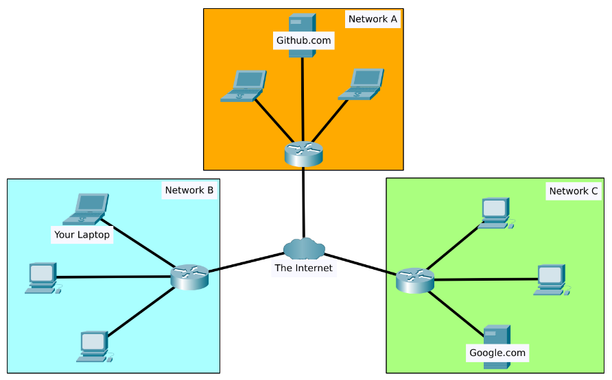

# Networking Overview

> This guide explains the basic idea of a computer network, why it's important, and how networks are all around us, in tech and in real life.

---

### 🌍 Part 1: What is a Network?

The main idea of a **network** is simple: it's all about **connection**. It's just a bunch of different things connected to each other. A good example is your group of friends—you're all connected by things you have in common.

This idea of connecting things isn't just for computers. You can see networks everywhere:

*   The bus or train routes in a city.
*   The power grid that brings electricity to our homes.
*   A neighborhood where people know each other.
*   The postal system that moves letters and packages.

When we talk about networking with computers, we're just doing the same thing, but with electronics. It's how your phone can grab information from the other side of the world. Networking is all about learning how these devices talk to each other and the rules (called **protocols**) they follow to make sure the conversation goes smoothly.

A computer network can be as small as two devices or as huge as the internet, which connects billions. The connected "things" on a network (**nodes**) can be regular computers and phones, or special tools like security cameras, smart traffic lights, and even smart farming equipment.

Because computer networks are a huge part of our daily lives—running everything from the weather forecast and power grids to traffic lights—**you can't be good at cybersecurity without understanding how networks work.**

---

### 🌐 Part 2: What is the Internet?

Now that we know a network is just a bunch of connected devices, what exactly *is* the Internet?

The **Internet** is one giant, worldwide network made up of many smaller networks all connected together. It's like a massive web linking millions of smaller networks.

*Figure: This diagram shows how your laptop (in Network B) uses the Internet to reach services like Github.com (in Network A) and Google.com (in Network C).*

To get a clearer picture, look at the diagram above. You can see how different private networks (like your home network) connect to the big "Internet cloud" to talk to services hosted in other networks.

The Internet started in the late 1960s as a U.S. military project called **ARPANET**. But the Internet we use today, with websites and links (the **World Wide Web** or **WWW**), was really born in 1989 when it was invented by Tim Berners-Lee. That's when it became a massive library for storing and sharing information.

So, how does this all fit together? Think of your home network (your laptop, phone, and smart TV) as a **private network**. It's your own little bubble. When you connect that bubble to the outside world (through your Internet Service Provider), you're joining a **public network**.

The Internet is just one giant public network made up of billions of smaller private networks all linked together. There are two main types of networks:

*   A **Private Network**: A network that is not connected to the internet (like a home or office network).
*   A **Public Network**: A network that is connected to the internet.
