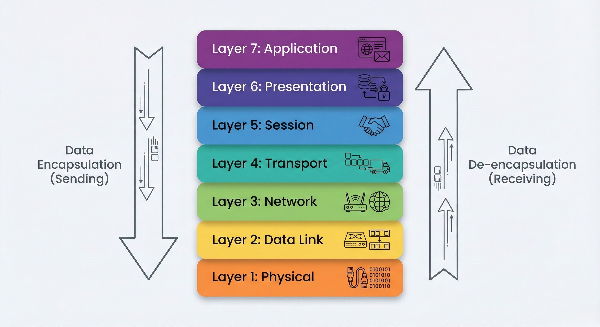
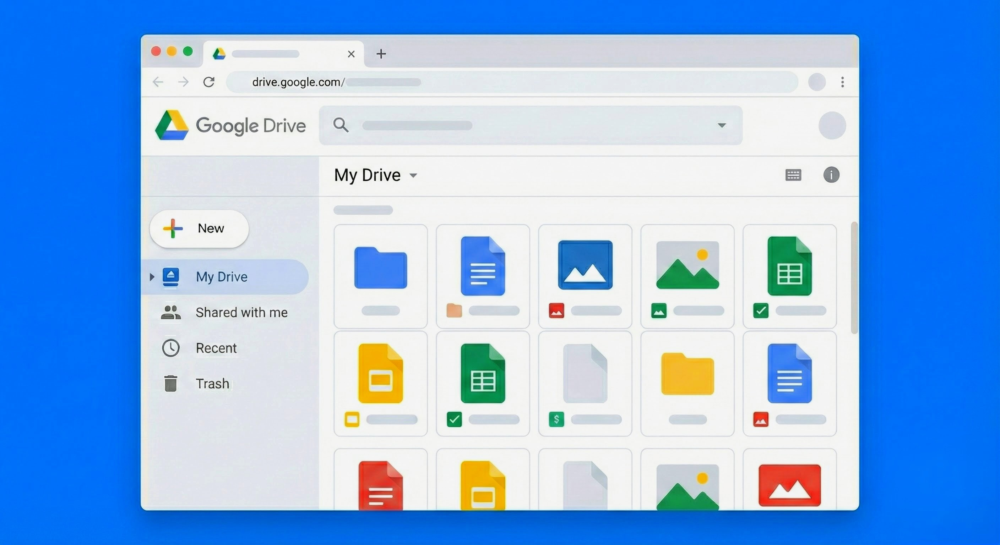

# The OSI Model

> This section breaks down the OSI model—a core concept that explains how different network devices can talk to each other.

---

## What is the OSI Model?

The **OSI (Open Systems Interconnection) model** is a rulebook for how computers communicate. Think of it as a universal language for network devices. It doesn't matter if you have a Mac, a Windows PC, or a smart fridge—as long as they follow the OSI rules, they can understand each other. This ensures a message sent from one device can be correctly interpreted by another, even if they are made by different companies.

### The Seven Layers

The OSI model is organized into seven layers, stacked on top of one another. We number these layers from top to bottom—starting with Layer 7 and going all the way down to Layer 1.

Each layer has its own specific job. When you send data, it travels down through these layers and gets wrapped in extra information at each step. This process is called **encapsulation**, and we'll explore it more later. When another device receives your data, it reverses the process, unwrapping the data as it travels back up the layers.

  
   
  <em>Figure 1: A diagram illustrating the seven layers of the OSI model.</em>

---

## 1. Layer 7 — Application

This is the layer you probably interact with the most, often without even realizing it! The **Application Layer** acts as the user's direct interface to the network. It's what connects you to all the amazing services and data available online.

These applications work at Layer 7 and provide the familiar graphical interfaces (GUIs) that you use daily. Some common examples, along with the protocols they often use, include:

*   **Web browsers** (**HTTP/HTTPS**) — for browsing websites
*   **Email clients** (**SMTP, IMAP, POP3**) — for sending and receiving emails
*   **File transfer apps** (**FTP, SFTP**) — for uploading/downloading files (like FileZilla)
*   Messaging apps, streaming services, and online games also operate at this layer, each with their own set of rules to communicate effectively.

This layer also defines important rules (**protocols**) that applications use to communicate. A great example is **DNS (Domain Name System)**. DNS is like the internet's phonebook—it translates easy-to-remember website names (like `google.com`) into the numerical **IP addresses** that computers actually use (e.g., `172.217.160.142`). Without DNS, you'd have to type long numbers to visit your favorite sites!

  
   
  <em>Figure 2: A computer screen displaying Google Drive in a web browser, illustrating a common Layer 7 interaction.</em>

