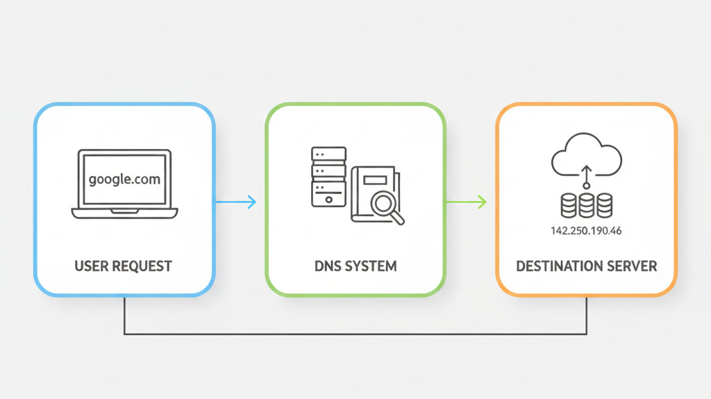

# DNS (Domain Name System)

> Think of DNS as the "phonebook" of the internet. It's the system that translates human-readable domain names into the IP addresses that computers use to find each other.

---

## 1. What is DNS?

The **Domain Name System (DNS)** provides a simple way for us to communicate with devices on the internet without having to remember complex strings of numbers.

Much like every house has a unique physical address for sending and receiving mail, every computer connected to the internet has its own unique address called an **IP Address**.

### 1.1. Why do we need DNS?

An IP address (specifically IPv4) typically looks like this: `104.26.10.229`. It consists of four sets of digits ranging from 0 to 255, separated by periods.

While computers are great at processing these numbers, they aren't very convenient for humans to remember. Imagine trying to memorize a different 12-digit number for every website you visit!

This is where **DNS** comes to the rescue:
*   Instead of remembering `142.250.190.46`, you just type **`google.com`**.
*   Instead of remembering `185.199.108.153`, you just type **`github.com`**.

  
   
  <em>Figure 1: DNS acting as a translator between domain names and IP addresses.</em>

DNS works silently in the background. Every time you visit a website or send an email, your device is likely performing multiple DNS lookups to find the correct "digital address" for the services you're trying to reach.

---

## 2. How DNS Works (Coming Soon!)

In the next section, we'll dive deeper into the hierarchy of DNS and how your browser actually finds that IP address.

---

## Test Your Knowledge

Think you've got it? Take a quick quiz to test your understanding.

**[Start the DNS Quiz](./quiz/index.html)**
